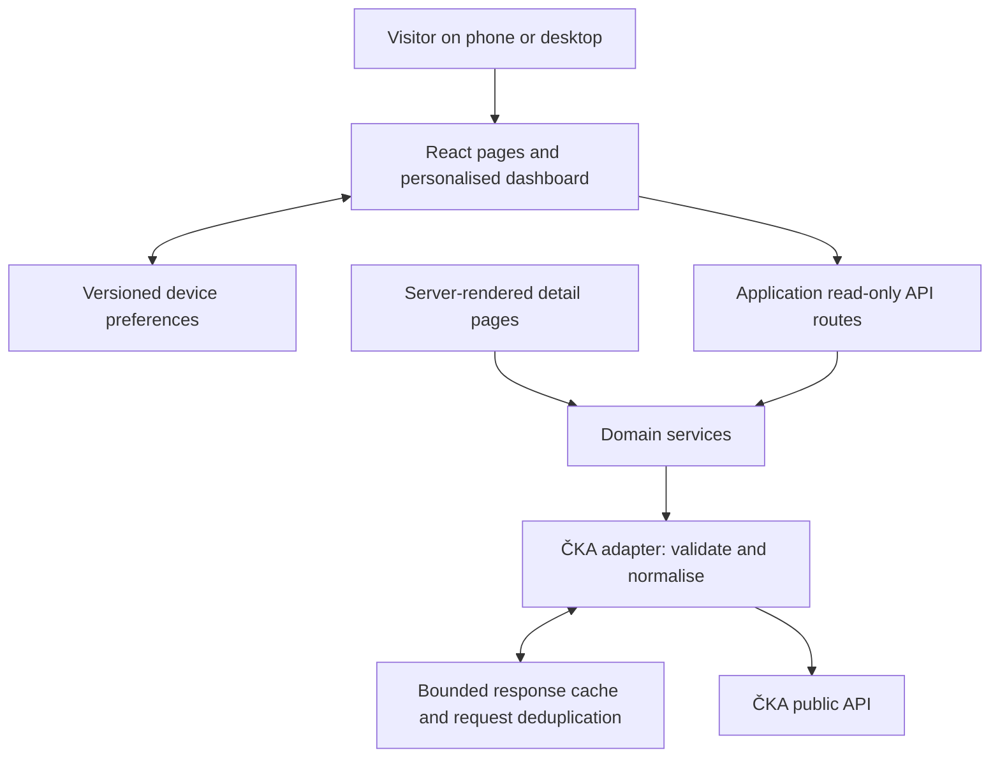

# Kuželkátor — solution architecture

Status: proposed architecture, before implementation

Date: 2026-09-28

Implementation note (2026-09-28): an initial Dockerised POC now implements weekly match browsing, team favourites, match detail, and competition standings. This document remains the target architecture; see [README.md](README.md) for the implemented subset, launch instructions, and current limitations. The POC uses request cooldown rather than automatic upstream retries, and a single 24-hour stale fallback limit.

## 1. Purpose

Build a Czech-language, mobile-friendly results application centred on the teams, players, and competitions a visitor follows. ČKA remains the source of sporting data; Kuželkátor provides navigation, presentation, personalisation, and derived analysis.

The first release should answer three questions immediately: **How did my team do? When does it play next? How are my favourite players performing?**

## 2. Scope

### First release

- Personal homepage with favourite teams, players, and competitions.
- Upcoming fixtures and recent results for followed teams.
- Competition schedules, standings, and player rankings.
- Match pages with team scores and available individual results.
- Player pages with recent performances, season statistics, and records.
- Club and venue details, linked from teams and matches.
- Preferences saved on the current device, without registration.
- Shareable detail pages and filters encoded in URLs.
- Clear loading, empty, incomplete-data, stale-data, and error states.

### Later releases

- Accounts and synchronisation of favourites across devices.
- Match reminders, result notifications, and calendar subscriptions.
- Richer comparisons and historical analysis, after validating data coverage.
- Installable PWA and explicitly scoped offline access.

The first release does not edit official results, collect ČKA credentials, promise throw-by-throw coverage, or duplicate the entire ČKA database.

## 3. Verified API capabilities and limits

Sources: [documentation](https://kuzelky.cz/api/docs/), [Swagger](https://kuzelky.cz/api/docs/swagger), and [public OpenAPI specification](https://kuzelky.cz/api/v1/public/openapi?variant=public).

Checked on 2026-09-28:

- The public schema declares unauthenticated access without an API key or registration. Its base URL is `https://kuzelky.cz/api/v1/public`.
- Anonymous GET requests to `/matches?limit=1` and `/seasons?limit=2` returned successful JSON responses.
- The match response included `Access-Control-Allow-Origin: *`, an ETag, and `Cache-Control: private, max-age=60, must-revalidate`. This is evidence for that response, not a guarantee for every endpoint.
- Match list responses omit related entities by default. Team names, competition information, and results require explicit `include` parameters.
- The schema documents competition tables, player statistics, player records, match results, clubs, teams, and venues. These endpoints still need representative integration checks.
- The seasons response listed seasons back to 2007/2008. This does not establish complete historical results coverage.
- The tested match response advertised `X-Search-Enabled: false`; full-text search must not be assumed available merely because a `q` parameter is documented.
- The seasons endpoint returned all 20 seasons despite `limit=2`. Pagination behaviour must be handled per endpoint.

The general partner documentation also describes authenticated scoring workflows. Those are separate from this application's public read-only integration. The client will allow only explicitly supported GET requests, even if the public specification exposes other methods.

Unknowns to resolve before production: usage limits and reuse terms, completeness by competition and season, update latency, public caching expectations, and correction behaviour for completed matches.

## 4. Architecture decision

Use a **single TypeScript web application** with a server-side API adapter. Proposed implementation stack: Next.js with React, CSS with shared design tokens, Zod for boundary validation, and TanStack Query for interactive browser requests. Pin concrete dependency versions when scaffolding the application.

This gives us shareable server-rendered detail pages and interactive personalisation in one deployment. A server adapter centralises upstream behaviour and lets us add caching and request controls without changing the UI. Browser-to-ČKA access may work for public endpoints, but the application will use its own API consistently.



Server-rendered pages call domain services directly; they do not make HTTP requests back into the same application. Browser queries use the application API routes, which call those same services.

## 5. Responsibilities

| Layer | Responsibility |
| --- | --- |
| Pages and components | Navigation, accessible presentation, user interaction, and data-state feedback |
| Browser query layer | Query keys, request cancellation, deduplication, and foreground refresh |
| Preference store | Favourite IDs, selected season, theme, and preference migrations |
| Application API | Validate inputs, bound work, and return stable application response shapes |
| Domain services | Assemble dashboard sections, resolve related entities, and calculate explicitly defined metrics |
| ČKA adapter | Construct allowlisted requests, validate upstream payloads, map statuses, and normalise data |
| Response cache | Revalidation metadata, bounded storage, stale fallback, and concurrent request coalescing |

The upstream base URL is fixed in server configuration. API routes must not accept arbitrary remote URLs or act as a general-purpose proxy.

## 6. Routes and navigation

| Route | Purpose |
| --- | --- |
| `/` | Personal dashboard; onboarding when no favourites exist |
| `/matches` | Matches filtered by date, competition, or team |
| `/matches/[id]` | Match detail |
| `/competitions/[slug]` | Competition schedule, standings, and player rankings |
| `/teams/[id]` | Team fixtures, results, and available statistics |
| `/players/[id]` | Player results, statistics, and records |
| `/clubs/[id]` | Club detail and links to known teams |
| `/venues/[id]` | Venue detail |
| `/settings` | Favourites, display preferences, and local-data reset |

Use numeric IDs for entity identity and favourites; use competition slugs where the upstream endpoint requires them. Treat seasons as explicit context. A favourite competition may belong to a specific season; do not silently match a new season's competition by name.

Store navigable filters in query parameters. Render dates in `Europe/Prague` by default using Czech formatting; preserve the source timestamp and timezone internally. Unknown dates remain unknown rather than becoming midnight fixtures.

## 7. API integration

| Feature | Documented upstream endpoints |
| --- | --- |
| Season selection | `GET /seasons` |
| Competition browsing | `GET /competitions`, `GET /competitions/{slug}` |
| Rounds and standings | `GET /competitions/{slug}/rounds`, `GET /competitions/{slug}/rounds/{round}/table` |
| Player rankings | `GET /competitions/{slug}/rounds/{round}/player-table` |
| Fixtures and scores | `GET /matches`, `GET /matches/{id}` |
| Team detail and statistics | `GET /teams/{id}`, `GET /teams/{id}/player-stats`, `GET /teams/{id}/records` |
| Player history | `GET /members/{id}`, `GET /members/{id}/match-results`, `GET /members/{id}/player-stats`, `GET /members/{id}/records` |
| Clubs and venues | `GET /clubs`, `GET /clubs/{id}`, `GET /venues`, `GET /venues/{id}` |

For match cards request only the required relations, for example `include=homeTeam,awayTeam,competition,results`. Load individual player results on demand for match details. Confirm the actual nested payload before implementing its mapper.

The public specification does not list a general team or member collection endpoint. Initially discover teams through competition tables and matches, and players through rankings and results. Offer browsing and filtering within loaded data; do not imply a complete global player search. Club-to-team navigation needs a verified mapping from these sources before it can claim completeness.

Normalise upstream data into application models such as `Season`, `Competition`, `Team`, `Player`, `MatchSummary`, `MatchDetail`, `StandingRow`, and `PlayerPerformance`. Each model retains its upstream identity and distinguishes missing values from zero. Preserve unrecognised status values for diagnostics and display a neutral fallback.

Use generated OpenAPI types where useful, plus runtime validation for the fields consumed by the UI. Keep upstream DTOs inside the adapter. Return application errors with stable categories such as `not_found`, `invalid_input`, `upstream_unavailable`, and `invalid_upstream_data`.

Derived statistics must document their formula, sample count, season, and discipline. Do not compare or average incompatible formats such as 100-throw and 120-throw results. Prefer official aggregates when their semantics are clear.

## 8. Personalisation and dashboard assembly

Persist a versioned object under a namespaced local-storage key. It contains favourite team IDs, player IDs, competition references, preferred season, and display preferences. It contains no credentials. Validate stored content and recover gracefully from corruption or unavailable storage.

The server renders a neutral dashboard shell. After hydration, the browser reads preferences and requests independent sections so one failure does not blank the page. Team favourites drive the fixtures feed; player and competition favourites initially appear as separate cards with links and summaries.

For team fixtures, query a bounded date window per team with limited concurrency, merge by match ID, and sort by fixture time. Do not download every match to filter in the browser. Paginate larger histories and load only visible sections. Provisional limits: 20 favourites per entity type and at most four concurrent upstream requests per application instance; revisit after measuring usage.

Use separate query keys for entity, season, filters, and included relations. Clear or invalidate affected browser queries when preferences change. Public entity data may share a cache; personalised responses must not be placed in a shared page cache.

## 9. Freshness, caching, and resilience

Use a bounded in-memory cache for the initial single Node.js instance, behind an interface that can later support a shared store. Cache canonical upstream GET requests, including their query parameters. Deduplicate concurrent identical requests.

The following are initial application targets, subject to upstream directives and confirmed usage limits:

| Data | Proposed revalidation interval |
| --- | --- |
| Visible ongoing matches | 60 seconds |
| Today's fixtures and recent results | 2 minutes |
| Standings and player statistics | 5 minutes |
| Seasons, club details, and venues | 24 hours |

Send `If-None-Match` when an ETag is available. A 304 keeps the payload and updates the last successful validation time. Distinguish this time from any upstream result-update timestamp. Because the observed upstream response is marked private, do not configure public CDN caching of raw API responses without confirming the intended policy.

Pause browser polling when the tab is hidden, avoid retry loops, and respect `Retry-After` on 429/503 responses. Start with a 10-second upstream timeout and at most two delayed retries for eligible read failures. Do not retry ordinary 4xx responses.

On temporary failure, show a previously validated payload with its age and a stale-data label. Initially cap stale fallback at 24 hours for match/statistics data and seven days for reference data. If no suitable cached payload exists, show a retryable error rather than an empty result list. Completed results still require revalidation because official corrections can occur.

“Live” means periodically refreshed official data; the application must not imply that the upstream supplies real-time throws or guaranteed update intervals.

## 10. Proposed code organisation

```text
src/
  app/                  Pages, layouts, and application API routes
  components/           Shared accessible UI components
  features/
    dashboard/          Personal dashboard composition
    matches/            Match lists and detail presentation
    competitions/       Schedules, standings, and rankings
    players/            Player history and statistics
    preferences/        Device preference store and onboarding
  domain/               Application models and calculation rules
  server/
    cka/                Upstream client, DTO validation, and mappers
    services/           Shared server-side use cases
    cache/              Cache interface and initial memory implementation
  lib/                  Date, formatting, and URL utilities
tests/
  fixtures/             Minimal representative upstream payloads
  integration/          Adapter and application API tests
  e2e/                  Key visitor journeys
```

This is a proposed structure, not an existing implementation.

## 11. Deployment and operations

Deploy one Node.js application with HTTPS, initially without a database or background workers. Keep public entity pages server-renderable and personalise the homepage in the browser. Choose the hosting provider at implementation time; an ephemeral or multi-instance host will need a deliberate cache strategy rather than assuming process memory is shared.

Record request duration, upstream status, cache hits, validation failures, and rate-limit responses. Avoid logging full player payloads or visitors' favourite lists. Provide a local health endpoint that does not request ČKA on every check. Link to the official source from result pages and show when data was last checked.

If accounts are introduced, add a database for application users and preferences. Keep application authentication separate from ČKA scoring authentication. Notifications would additionally require a scheduler, delivery service, and deduplication of result changes; they are not part of the first deployment.

## 12. Validation strategy

- Validate representative completed, scheduled, ongoing, postponed, and incomplete matches where available, including substitutions and multiple disciplines.
- Test DTO mapping, null versus zero handling, date boundaries in Prague time, pagination differences, and standings interpretation.
- Test ETag revalidation, stale fallback, timeout handling, 429 backoff, and bounded dashboard request fan-out with controlled responses.
- Exercise onboarding, following a team/player, preference persistence, season changes, and match navigation in browser tests.
- Check keyboard access, readable score tables, narrow-screen layouts, and explicit error states.
- Keep live API smoke checks small and manually invoked or scheduled sparingly; routine CI uses fixtures and does not depend on upstream availability.

## 13. Delivery sequence

1. **Validate the data contract:** inspect representative detail/statistics responses, verify identity links and discovery paths, and resolve API usage questions. Record gaps before promising features.
2. **Build a vertical slice:** scaffold the application, implement the adapter and cache, then deliver a real match list and match detail page with failure states.
3. **Add personalisation:** competition/team discovery, device favourites, and the personal fixtures dashboard.
4. **Add player and competition views:** standings, rankings, player history, and carefully defined charts based on verified fields.
5. **Prepare release:** verify accessibility, mobile behaviour, request volume, attribution, observability, and deployment.

First-release acceptance: a visitor can find and follow a team, reload and retain that choice, see its upcoming and recent matches, open available player results and standings, and understand when official data is missing or stale. No ČKA account is required.
